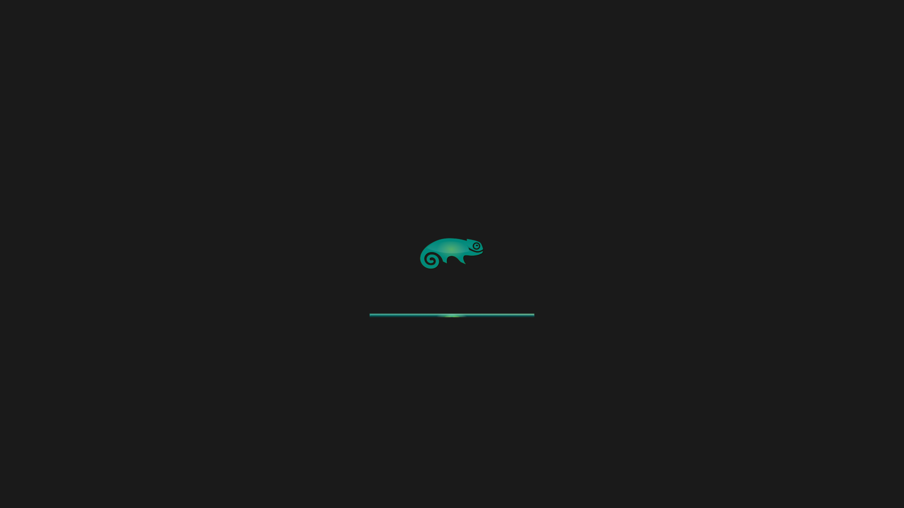

# Cristal Bar OpenSuse - Dark (Plasma 6 Splash)

Custom Plasma 6 splash screen package based on the original work by [mrmaire](https://github.com/mrmaire).

## Preview



## Attribution

- Original author: [mrmaire](https://github.com/mrmaire)
- This repository: adaptation/derivative by [dangz0](https://github.com/dangzo)

If you are the original author and want any attribution text adjusted, open an issue and it will be updated.

## License

This project is licensed under GPLv3.

- See the full text in [LICENSE](LICENSE)
- Package metadata license field: GPLv3 in [metadata.json](metadata.json)

## Redistribution

This repository is intended for redistribution under GPL terms.

When redistributing:

- Keep attribution to original authors
- Keep this license and copyright notices intact
- Publish modifications under GPL-compatible terms

Note: names and logos (for example openSUSE branding) may be subject to trademark rules separate from copyright licensing.

## Install (Local)

Copy this project to your local Plasma splash packages directory:

```bash
mkdir -p ~/.local/share/plasma/look-and-feel/
cp -r "$PWD" ~/.local/share/plasma/look-and-feel/
```

Then select it in System Settings:

1. Open System Settings
2. Go to Colors & Themes > Splash Screen
3. Choose Cristal Bar OpenSuse - Dark

## KDE Store

Before uploading to KDE Store:

- Verify all included assets are redistributable
- Ensure attribution is present in listing text
- Use a unique package ID/name if needed to avoid confusion with upstream
